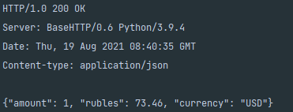
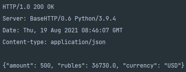

### Конвертор валют

Нужно реализовать простой сервис конвертера валют USD -> RUB (источник данных - любой веб-ресурс на ваш выбор. Не API. Данные нужно парсить с web страницы.).

Интерфейс - HTTP API, который по запросу отдает  JSON с результатом конвертации (валюта, запрошенное значение, результирующее значение, и т.д.) или ошибкой с соответствующим кодом и сообщением в секции “error”.

### Документация

Скачиваем репозиторий и переходим в директорию проекта.

``git clone https://github.com/dnantonov/currency_converter && cd currency_converter``

**Запускаем сервер**

``python server.py``

*Получение данных о курсе одного доллара.*  
Метод: GET. Вводим в новом окне терминала следующую команду:

``curl http://localhost:8080``  

В качестве результата получаем следующий вывод:

  
Здесь значение rubles соответствует курсу одного доллара США

*Получение данных о курсе доллара с запрошенным значением.*  
Для значения amount указываем конвертируемое количество долларов.  
Метод: POST. Вводим в новом окне терминала следующую команду:

``curl --data '{"amount":500}' --header "Content-Type: application/json" http://localhost:8080``  

В качестве результата получаем следующий вывод:

**Запускаем тесты**

В терминале вводим следующую команду, не приостанавливая работу сервера:

``python -m unittest``
